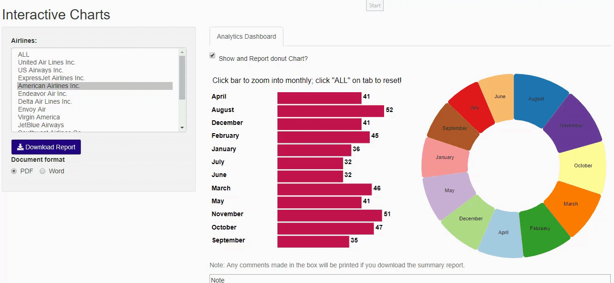

# D3_folded_charts
This is a showcase of interactive charts in shiny and Rmarkdown reports! Live shinyapp: https://appforiarteam.shinyapps.io/Interactive_charts_reports/ 

Note: this app used `noteMD` R package (Repos: https://github.com/jienagu/noteMD) and `nivopie` (Repos: https://github.com/jienagu/nivopie) R package (htmlwidget) from my Github! 

## The design 

* Folded data structure:  
  - zoom in to monthly chart by either clicking bar or the dropdown menu from slidebar. Click "ALL" from dropdown selector to reset! When zooming in monthly chart, both bar chart and donut chart are zoom into monthly level.

* Customize charts show/hide 
  - Users can check/uncheck to decide whether they want to show the donut chart!

* Customize charts in reports
  - Users can check/uncheck to decide whether they want to print the donut chart in reports or not.

* Custmize note
  - Users can take notes under charts and their notes will be printed in the reports. 

# Acknowledgement
Beef Cattle Institute from Kansas State University
